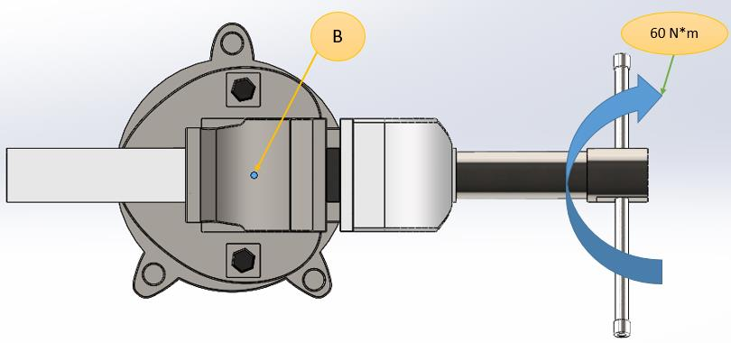
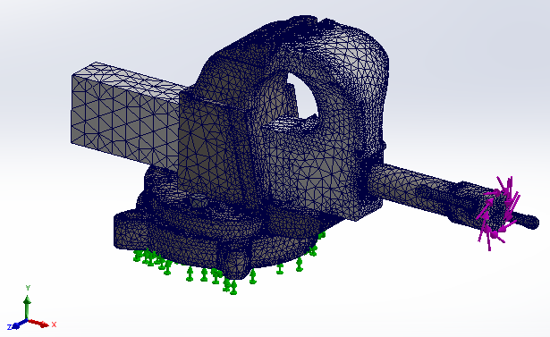
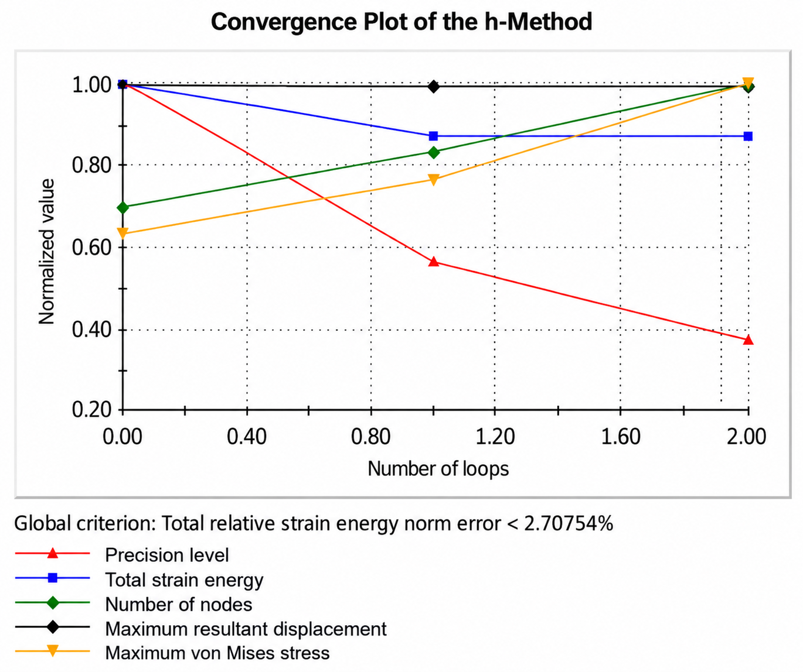
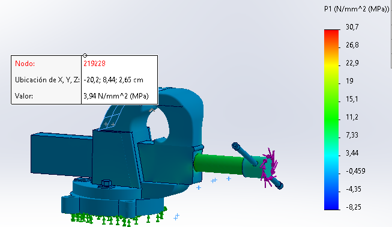
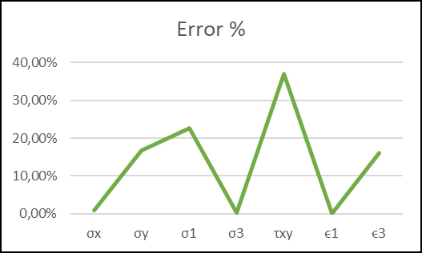
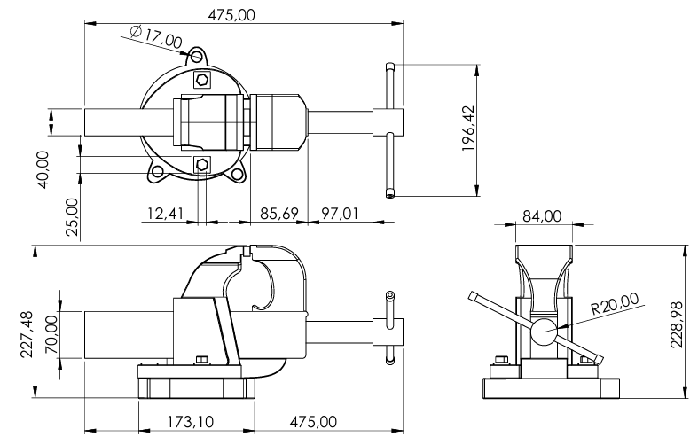

# FEM Static Analysis of a Bench Vise

Static finite element analysis (FEM) of a bench vise in **SolidWorks Simulation**. The study finds the principal stresses and strains at a strain-gauge rosette location (**position B**) and validates them against analytical results from experimental strain-gauge readings.

Final project for **IM0238 – Finite Element Methods**, School of Applied Sciences and Engineering, **Universidad EAFIT** (Medellín, Colombia), May 2024.



---

## Model

- **CAD:** 7 parts modeled in SolidWorks from measurements of a real bench vise. Parts: movable jaw, fixed jaw, slide, clamping screw, power screw, handle and a 10 mm steel sheet between the jaws.
- **Load:** 60 N·m torque, applied clockwise on the power screw handle
- **Fixture:** fixed support under the vise base
- **Contacts:** global bonded interaction, meshed independently
- **Elements:** solid elements with a fine, curvature-based mesh
- **Solver method:** h-adaptive refinement (global strain-energy error < 2.71 %)

| Part | Material |
|---|---|
| Movable jaw | AISI 4140 steel |
| Fixed jaw | AISI 1045 steel |
| Slide | AISI 4140 steel |
| Clamping screw | Mild steel |
| Power screw | AISI 316 stainless steel |
| Handle | Carbon steel |
| Sheet | AISI 1020 steel |

<p>
  
  
</p>

## Validation

**Analytical side:** three strain-gauge tests at position B, with gauges at 0°, 45° and 90°. Principal stresses and strains were computed with E = 205 GPa and ν = 0.3, then averaged over the three tests.

**Comparison:** the averaged analytical values against the FEM results.

| Variable | Analytical (avg.) | FEM | Error |
|---|---|---|---|
| σx | −0.240 MPa | −0.238 MPa | 0.83 % |
| σy | 3.545 MPa | 2.87 MPa | 16.8 % |
| σ1 | 5.091 MPa | 3.94 MPa | 22.6 % |
| σ3 | −1.576 MPa | −1.58 MPa | 0.25 % |
| τxy | −2.813 MPa | −1.77 MPa | 37.07 % |
| ε1 | 2.714 × 10⁻⁵ | 2.71 × 10⁻⁵ | 0.14 % |
| ε3 | −1.513 × 10⁻⁵ | −1.268 × 10⁻⁵ | 16.19 % |

<p>
  
  
</p>

**Findings:**

- σx, σ3 and ε1 match almost exactly, with errors below 1 %.
- σy, σ1 and ε3 show moderate errors of 16–23 %.
- The in-plane shear stress τxy has the largest error, 37 %, most likely due to where the result was sampled.

**Likely error sources:**

- Wear on the physical vise, which affects both the measured dimensions and the gauge readings
- Simplifications in the material models
- Differences between the analytical and numerical formulations

## Repository structure

```
01_CAD/
  SolidWorks/     Parts (.SLDPRT), assembly (.SLDASM) and drawing (.SLDDRW)
02_Report/        Final report (PDF, in Spanish)
03_Archive/       Pack and Go backup of the SolidWorks files (May 29, 2024)
04_Images/        Figures taken from the report
```

## Opening the model

Open `01_CAD/SolidWorks/ensamble_prensa_metodos_finitos.SLDASM` in SolidWorks. Keep every part in the same folder so the assembly and the drawing (`Plano.SLDDRW`) find their references. 



## Author

**David Zuluaga Henao** — Mechanical Engineering, Universidad EAFIT
